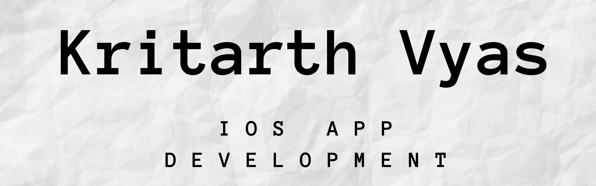

#  WeatherX
## Overview

A dark-mode enabled iOS app that grabs live weather data using API from https://openweathermap.org/api and allows users to check the live weather for the current location based on the GPS data from the iPhone as well as by searching for a city manually using Swift protocols and extensions, and Core Location framework. 

## Live Demo
#### WeatherX Live Demo

## Learning Objectives

* Creating a dark-mode enabled app.
* Using vector images as image assets.
* Swift protocols and extensions. 
* Swift closures and completion handlers.
* Using URLSession to network and make HTTP requests.
* Parsing JSON with the protocols. 
* Usingse Core Location to get the current location from the phone GPS. 

>This project is inspired from The App Brewery's Complete App Development Bootcamp - Clima Project.

